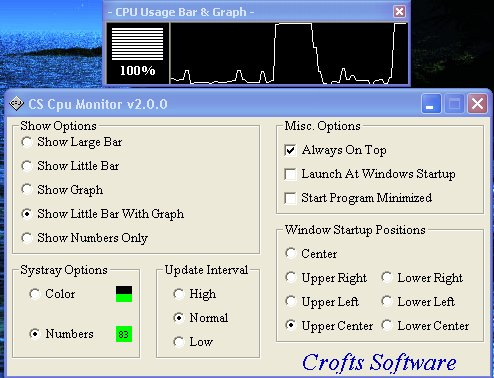



## CS CPU Monitor

### Description

It took me about 8 hours to make this, I got the cpu code from somewhere a while ago and made a lot of changes and added a lot. It is fully done and has a lot of options. It shows how to get cpu usage for all versions of windows, how to write and delete from the run section of the reg., shows how to read and write form a inf file, and also shows how to use the systray. Also shows how to position forms and a lot of other little stuff.
 
### More Info
 

             |
---                |---
**Submitted On**   |2002-01-22 17:54:30
**By**             |[Shane Croft](https://github.com/Planet-Source-Code/PSCIndex/blob/master/ByAuthor/shane-croft.md)
**Level**          |Intermediate
**User Rating**    |4.9 (39 globes from 8 users)
**Compatibility**  |VB 5\.0, VB 6\.0
**Category**       |[Complete Applications](https://github.com/Planet-Source-Code/PSCIndex/blob/master/ByCategory/complete-applications__1-27.md)
**World**          |[Visual Basic](https://github.com/Planet-Source-Code/PSCIndex/blob/master/ByWorld/visual-basic.md)
**Archive File**   |[CS\_CPU\_Mon504711222002\.zip](https://github.com/Planet-Source-Code/shane-croft-cs-cpu-monitor__1-31087/archive/master.zip)

